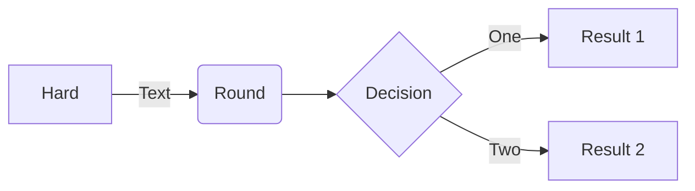

# Учусь оформлять Markdown файл!

## Для этого прохожу курс по Git, как ни с транно.

# Данный репозиторий носит исключительно ***учебный*** характер.

**В нем я чусь как:**
1. Инициализировать репозиторий
2. Сохранять файлы, подготавливать к сохранению
3. Коммитить
4. Смотреть историю коммитов
5. Связывать репозитории локальные и удаленные
6. Пушить

Вот вам [ссылка](https://github.com/IgnatyKhramtsov "Я ссылка)") на мой GitHub!

# А теперь добавим *mermaid*-схему статусов файлов




```mermaid
graph LR;
  untracked->>staged: git add
  modified  -- " git add " --> staged;
  staged    -- " git commit "     --> tracked/comitted;
  tracked/comitted -- " изменения " --> modified;
  staged -- " изменения " --> modified;
```

ВОТЬ


